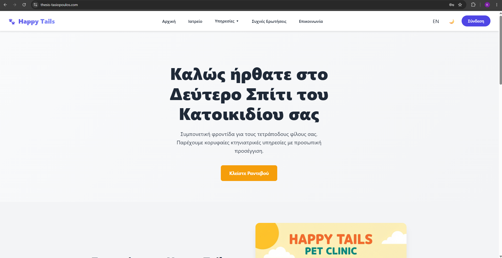
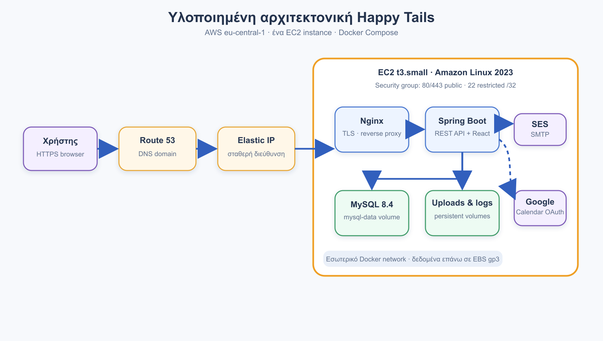
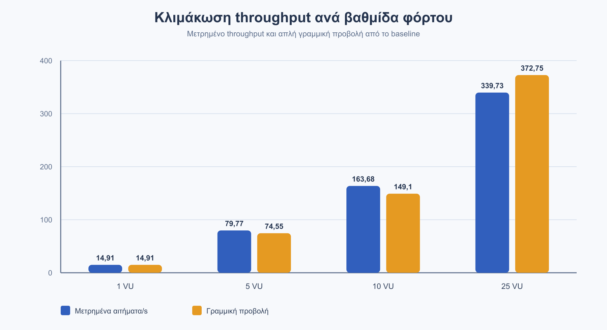

# Happy Tails

[](https://github.com/Tasiop6/pet-clinic-thesis-public/actions/workflows/application-ci.yml)
[](https://github.com/Tasiop6/pet-clinic-thesis-public/actions/workflows/build-thesis.yml)


[](LICENSE.txt)

Happy Tails is a full-stack veterinary-clinic management system and the case study for the diploma thesis **Optimizing Cloud Infrastructure for Mission-Critical Applications**. It combines clinical workflows, staff account governance, appointment scheduling, document handling, email verification, and calendar integration with a reproducible AWS deployment and measured performance evaluation.



## What the system does

- Manages owners, pets, veterinarians, visits, prescriptions, and uploaded clinical documents.
- Provides role-aware staff registration with email verification, administrator approval, account blocking, deactivation, and deletion.
- Synchronizes appointments with Google Calendar through OAuth 2.0 and sends calendar invitations to pet owners.
- Uses Amazon SES for transactional staff-account messages such as registration verification and password reset.
- Offers a responsive React interface in Greek and English.
- Includes containerized local deployment, AWS infrastructure documentation, automated backups, and repeatable evaluation utilities.

## Architecture

The application is a modular Spring Boot system with a React single-page application. REST controllers expose the application services, while JPA repositories persist domain data in MySQL. Liquibase applies versioned schema migrations. Nginx serves as the public reverse proxy in the container deployment.

The evaluated cloud deployment used Route 53, an Application Load Balancer, EC2, EBS, S3, CloudWatch, SES, and a CloudFront proof of concept. Google Calendar is an independent external integration reached through its API; calendar invitations are not sent through SES.



## Engineering work showcased

- Migration of the classic PetClinic server-rendered interface to a typed React SPA and REST-oriented backend.
- JWT-based authentication and authorization with staff lifecycle controls.
- Two-stage account onboarding: email ownership verification followed by administrator approval.
- Google Calendar OAuth integration with appointment creation, update, cancellation, and retry handling.
- Amazon SES transactional email integration with expiring verification and password-reset tokens.
- File-upload validation and controlled document access.
- Liquibase database migrations and Docker Compose deployment.
- Cloud monitoring, backup, recovery, security, load, and soak-test evaluation.

## Technology stack

| Area | Technologies |
| --- | --- |
| Backend | Java 17, Spring Boot 3.2, Spring Security, Spring Data JPA, Liquibase |
| Frontend | React 19, TypeScript 5.9, Vite 7, TanStack Query, FullCalendar, Recharts, i18next |
| Data | MySQL 8.4, EBS, S3 backups |
| Integrations | Google Calendar API and OAuth 2.0, Amazon SES SMTP |
| Delivery | Maven, npm, Docker Compose, Nginx, GitHub Actions |
| Cloud and operations | AWS EC2, ALB, Route 53, CloudWatch, S3, SES, CloudFront proof of concept |

## Evaluation highlights

The thesis evaluates one frozen deployment with functional, security, upload-limit, load, soak, recovery, and cost observations. Results are evidence for this specific configuration rather than universal capacity claims.

- Baseline: 895 requests in 60.04 seconds, 14.91 requests/second, with no HTTP errors.
- Staged load at 1, 5, 10, and 25 virtual users reached 339.73 requests/second with no HTTP errors.
- Read-oriented endpoints remained below 110 ms at the 95th percentile in the measured runs.
- A five-minute soak test completed 26,291 requests at 87.55 requests/second with no HTTP errors.
- Controlled restart recovery restored application availability in 40.79 seconds.
- Password hashing became the dominant bottleneck at the highest login concurrency, an explicit result discussed in the dissertation.



## Repository structure

```text
pet-clinic-data/       Domain model and persistence module
pet-clinic-web/        Spring Boot web module and React frontend
docker/                Nginx and container configuration
infra/                 AWS deployment templates and operational configuration
scripts/performance/   Reproducible evaluation utilities
thesis-overleaf/       Complete XeLaTeX dissertation source and figures
thesis/                Compiled dissertation PDF
```

The dissertation is available at [`thesis/Happy-Tails-Thesis.pdf`](thesis/Happy-Tails-Thesis.pdf). The full source is retained so that the document and its figures remain reproducible.

## Run locally

### Prerequisites

- Java 17 or later
- Docker with Docker Compose
- Git

The Maven build downloads the pinned Node.js and npm versions used for the frontend build.

```bash
git clone https://github.com/Tasiop6/pet-clinic-thesis-public.git
cd pet-clinic-thesis-public
cp .env.example .env
```

Replace every `CHANGE_ME` value in `.env`, then build and start the stack:

```bash
./mvnw -B clean package
docker compose up --build
```

Open `http://localhost`. Google Calendar and Amazon SES are optional for the core local workflows; leave their integration values empty when they are not being tested.

On Windows, use `mvnw.cmd` instead of `./mvnw`.

## Verification

Run the complete backend and frontend verification pipeline with:

```bash
./mvnw -B verify
```

The repository also runs application verification, frontend dependency auditing, and XeLaTeX thesis compilation in GitHub Actions. Performance scripts require an explicitly supplied target and dedicated test credentials; they never embed credentials in result files.

## Configuration and security

Runtime secrets, uploads, backups, logs, build output, IDE files, and generated test results are excluded from version control. Copy `.env.example` to `.env` and keep the populated file local. Use SES-generated SMTP credentials rather than AWS access keys, and use a dedicated Google OAuth client for each deployment environment.

## Project origin and license

Happy Tails builds on the Spring PetClinic family of reference applications, including the [Spring Framework Guru PetClinic](https://github.com/springframeworkguru/sfg-pet-clinic) structure and the [canonical Spring PetClinic](https://github.com/spring-projects/spring-petclinic). The substantial project-specific additions are summarized above and documented in the dissertation.

The inherited and project code is distributed under the [Apache License 2.0](LICENSE.txt). See [NOTICE](NOTICE) for attribution.
